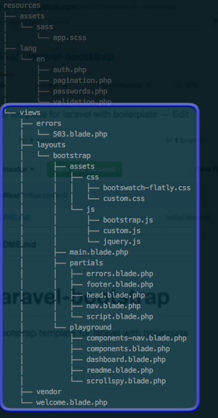

# laravel-bootstrap
Bootstrap template for laravel with boilerplate

## Installation

- Copy this `bootstrap` folder to your `resources/views/layouts`. Your resources directory will look like this:



- Copy `bootstrap/assets` to `public/assets`
- Setup route to test

```
Route::get('bootstrap/{playground?}',function($playground = 'readme'){

$validator = Validator::make(Request::all(), [
  'title' => 'required|unique:posts|max:255',
  'body' => 'required',
]);

// Uncomment below code to display template with no error banner
// return view('layouts.bootstrap.playground.'.$playground);

return view('layouts.bootstrap.playground.'.$playground)->withErrors($validator);

});
```

- visit [localhost:8000/bootstrap]()   
*(assuming that your laravel is hosted locally at port 8000)*